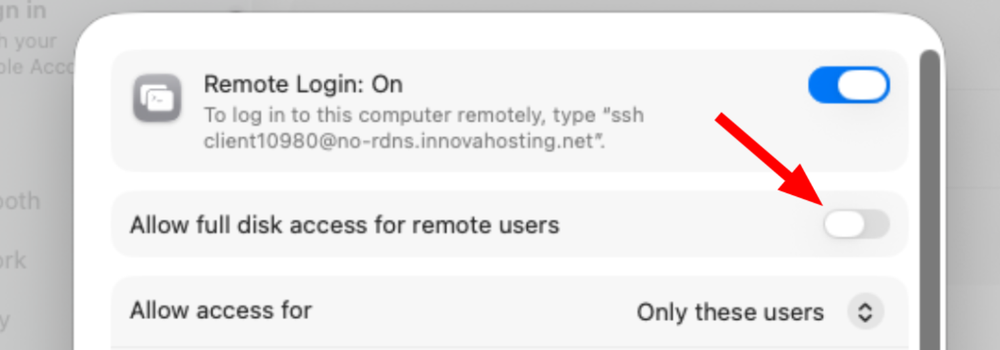

# Ansible Role: Nix

Deploys [Determinate Nix](https://docs.determinate.systems/) v3.22.5 on **Debian/Ubuntu** and **macOS (Darwin)** hosts.

## Platform support

| Platform | Method |
|---|---|
| Debian / Ubuntu | Multi-user Determinate Nix installation and configuration |
| macOS (Darwin) | Multi-user Determinate Nix installation and [nix-darwin](https://github.com/LnL7/nix-darwin) flake-based setup |

## Variables

| Variable | Default | Description |
|---|---|---|
| `nix_user` | `admin` | User for whom Nix is installed |
| `nix_version` | `3.22.5` | Determinate Nix release to install |
| `nix_installer_sha` | platform-specific | SHA256 of pinned release installer binary |
| `nix_multi_user` | `true` | Required; Determinate Nix Installer manages multi-user installs |
| `nix_settings` | defaults in `defaults/main.yml` | Key/value pairs written to `/etc/nix/nix.custom.conf` (Linux only) |
| `nix_extra_settings` | `{}` | Merged on top of `nix_settings` for per-host overrides |
| `nix_access_tokens` | `{}` | Host/token pairs for Nix `access-tokens` setting |
| `nix_access_tokens_file` | `/etc/nix/access-tokens.conf` | Where `nix_access_tokens` are written |
| `nix_force_apply` | `false` | Force `nix-darwin switch` even when config is unchanged |
| `nix_cleanup_delete_older_than` | `30d` | Nix Store cleanup removes entries older than this |
| `nix_additional_inputs` | `{}` | Key/values pair of addtionnal inputs |

### nix_settings / nix_extra_settings

Written to `/etc/nix/nix.custom.conf` on Linux via `lineinfile` insce Determinate Nix owns `/etc/nix/nix.conf`.
Settings are ignored on Darwin where `nix-darwin` or the Determinate nix-darwin module manages configuration.
```yaml
nix_extra_settings:
  sandbox: true
```

### nix_access_tokens

Written to `nix_access_tokens_file` and pulled into Determinate's custom configuration with `!include` on both Linux and Darwin.
This keeps tokens out of the Nix store on Darwin, where nix-darwin and the Determinate module generate Nix configuration.
Nix uses these for `github:` flake inputs and `fetchTree` calls, avoiding unauthenticated API rate limits.

```yaml
nix_access_tokens:
  'github.com': 'ghp_...'
```

### nix_additional_inputs

Add additional inputs to the `flake,nix`:

```
nix_additional_inputs:
  unstable: 'github:NixOS/nixpkgs/commit-rev'
```

## Darwin prerequisites

- macOS 12 or higher (Apple Silicon or Intel)
- nix-darwin configuration compatible with Determinate Nix: disable nix-darwin's built-in Nix configuration (`nix.enable = false`) or enable Determinate's nix-darwin module
- Templates `nix/flake.nix.j2` and `nix/configuration.nix.j2` present in the calling playbook

## Darwin behaviour

The role installs Determinate Nix and backs up shell files that conflict with nix-darwin (`bashrc`, `zshrc`, `zprofile`) before running `nix-darwin switch`.
Backups are written to `<file>.before-nix-darwin` and only created once - subsequent runs are idempotent.

## Handlers

| Handler | Trigger |
|---|---|
| `restart nix-daemon` | Any change to `/etc/nix/nix.custom.conf` |

# Known Issues

- Nix install fails with: `vifs: error creating /etc/fstab`
  - Go to: `System Settings` → `General` → `Sharing`
  - Click ⓘ icon next to `Remote Login`
  - Enable `Allow full disk access for remote users.`
  - 
